# Diabetic retinopaty CNN
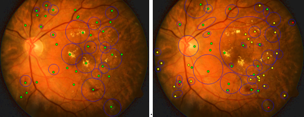

__Cli tool__, allowing to generate, train and predict diabetic retinopaty, based on
https://github.com/luigisaetta/diabetic-retinopathy

and __dataset__, downloaded from
https://www.kaggle.com/competitions/diabetic-retinopathy-detection/data

### validation score

```shell
Accuracy score: 0.85%
              precision    recall  f1-score   support
           0       0.89      0.98      0.93      7308
           1       0.49      0.27      0.35       720
           2       0.77      0.63      0.69      1594
           3       0.54      0.51      0.53       232
           4       0.80      0.59      0.68       194
    accuracy                           0.85     10048
   macro avg       0.70      0.60      0.64     10048
weighted avg       0.84      0.85      0.84     10048
```

### confusion matrix
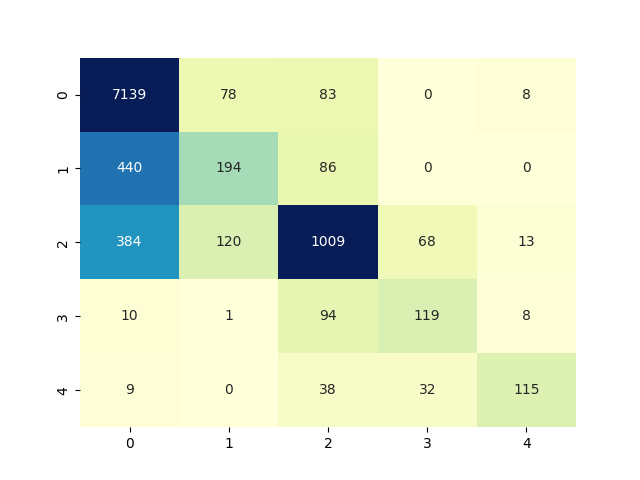

### generate usage
```
python -m drcli generate [OPTIONS]
Options:
  -l, --file-labels TEXT     train labels file, format csv: id_<side>,level
  -t, --train-dir TEXT       train dir, directory with source images, used for
                             training, dir must exist
  -d, --dest-dir TEXT        destination dir for output tfrec files, dir must
                             exist
  -s, --sample-dir TEXT      sample dir, used for printing preprocessed
                             images, used temporary for test purposes only
  -c, --batch-size INTEGER   tfrec row size, number of tensors per single
                             tfrec file
  -p, --image-callback TEXT  preprocess callback, choose from "gaussian", "no
                             gaussian" so far
  -k, --kind TEXT            tfrec, used for testing or training, use either
                             "train" or "test"
  --help                     Show this message and exit.
```

### train usage
```
python -m drcli train [OPTIONS]
Options:
  -r, --run-on TEXT          on Windows, use GPU, on  GKE use TPU
  -s, --source-dir TEXT      source dir: directory with train*.tfrec files,
                             must exist
  -d, --dest-dir TEXT        directory for storing weight coefficients, logs
  -i, --img-res INTEGER      tensor resolution
  -f, --folds-count INTEGER  number of folds for KFold, lower if going to
                             train tiny number of tfrecs
  -e, --epoch-count INTEGER  epoch count
  -b, --batch-size INTEGER   train batch size, 4 is maximum for GPU with 11GB
                             of VRAM
  -n, --efn-index INTEGER    EFN index: 0 for EfficientNetB0, 4 for
                             EfficientNetB4, etc
  -v, --verbose BOOLEAN
  -p, --should-plot BOOLEAN  If true - plot learning intermediate results
  --help                     Show this message and exit.
Process finished with exit code 0

```

### predict usage
```
Usage: python -m drcli predict [OPTIONS] FILENAME
Options:
  --help  Show this message and exit.
  
Example:
  python -m drcli predict "G:\Storage\datasets\retinopaty\source\diabetic-retinopathy-detection\test\107_left.jpeg"
  File G:\Storage\datasets\retinopaty\source\diabetic-retinopathy-detection\test\107_left.jpeg
  Severity 0 with probability 89.57%
  Probability distribution:
  0: 89.57%
  1: 6.85%
  2: 3.51%
  3: 0.05%
  4: 0.02%
```

# Download trained weights
### Link
https://file.io/dvJku7TEseai
### Qr code


# Train chart samples 
Preprocess method: **no_gaussian**

### Accuracy
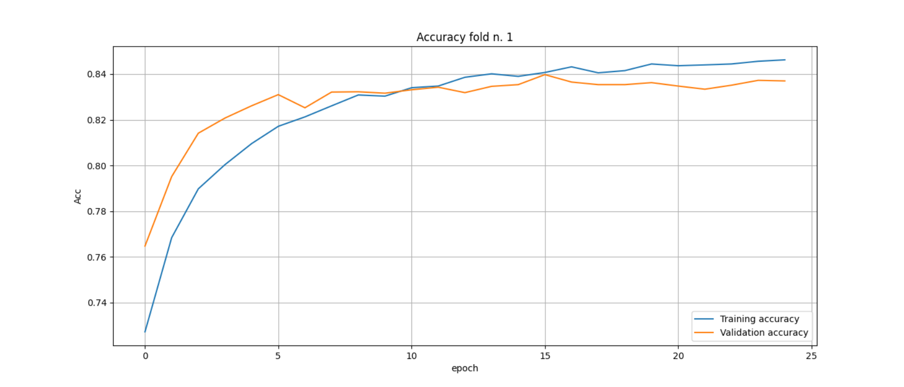
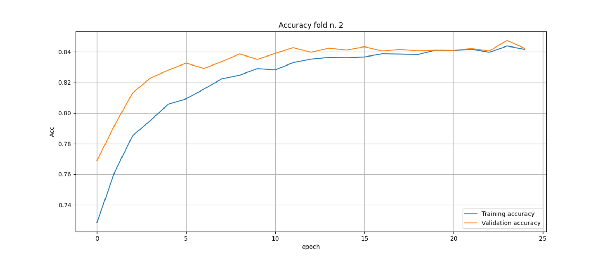
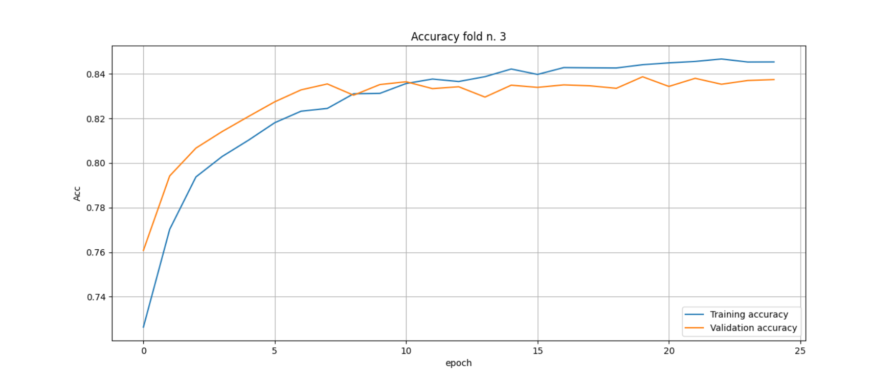
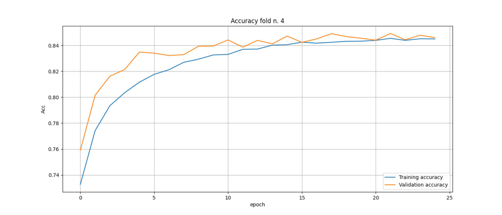
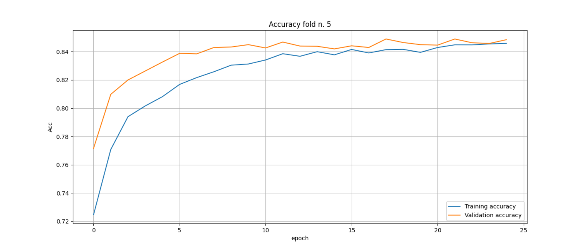

### Loss
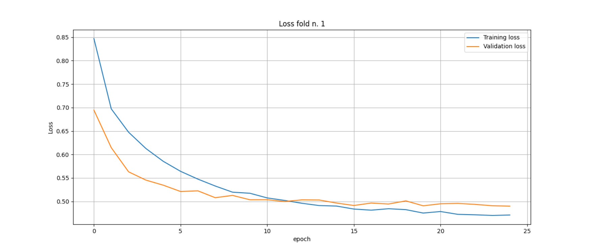

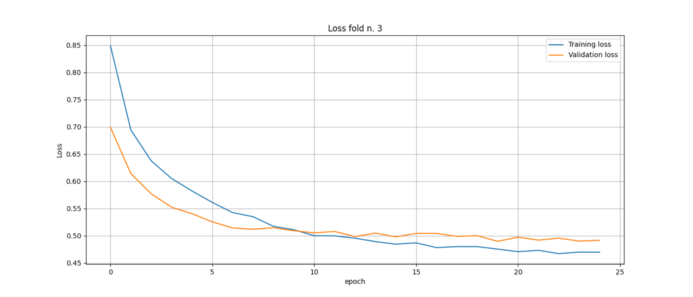
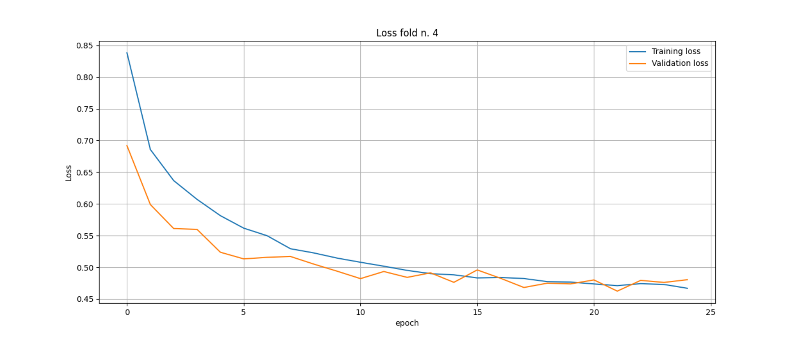
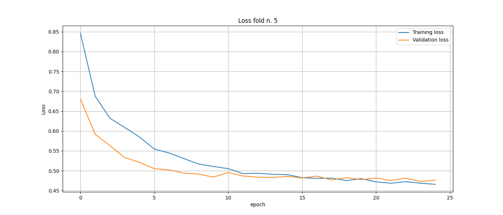